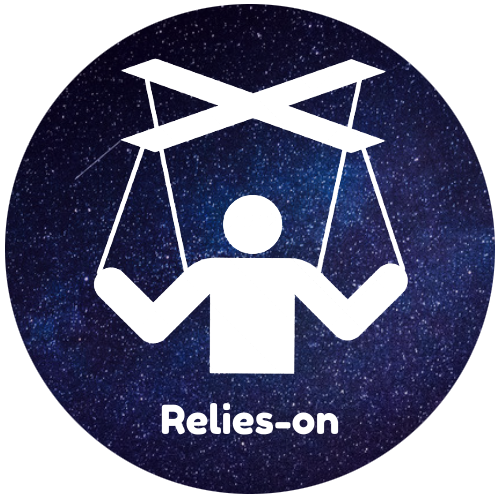

<h1 align="center">
     
</h1>

<h4 align="center">
  A Github action that makes a workflow rely on the status of another.
   
   
  <i>"Relies-on is to workflows as <code><a href="https://docs.github.com/en/actions/using-workflows/workflow-syntax-for-github-actions#jobsjob_idneeds">needs</a></code> is to jobs" - Relies-on Author 😉</i>
</h4>

##

 

    
    
  
  

    
    
    
    
    
    
    

##

## Why does Relies-on exist? 👽

blah blah blah...

## How could aliens use this action? 🖱️

blah blah blah...

## License 🚓

This project is licensed under an [MIT](./LICENSE) license.

##

Give a ⭐️ if this project helped you!
